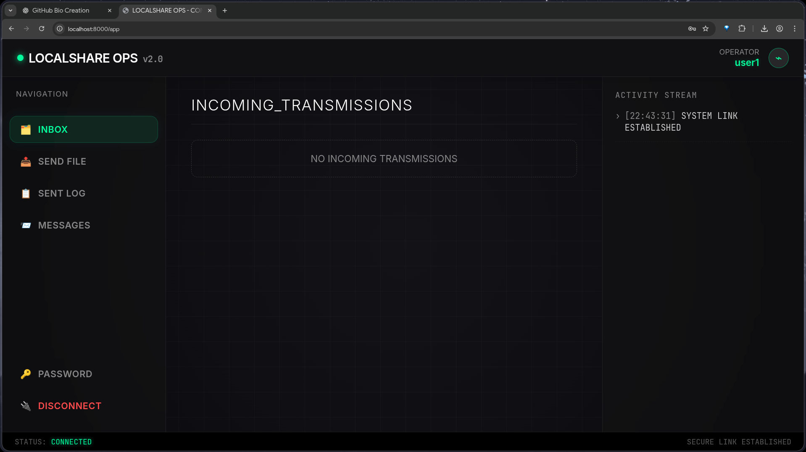
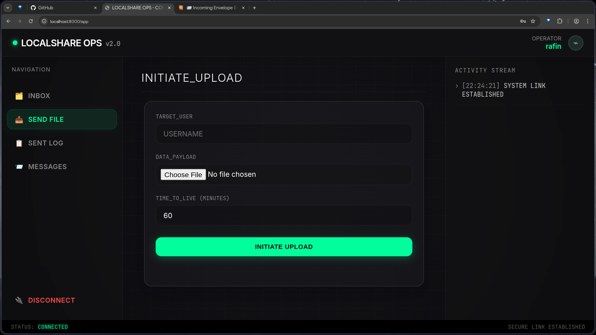
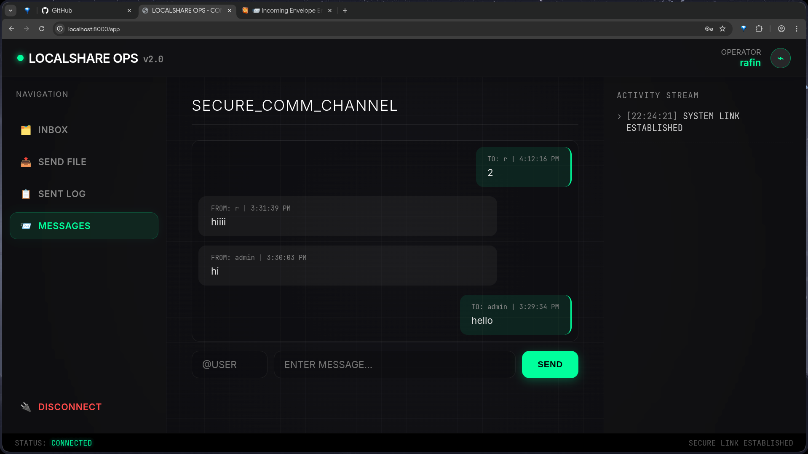
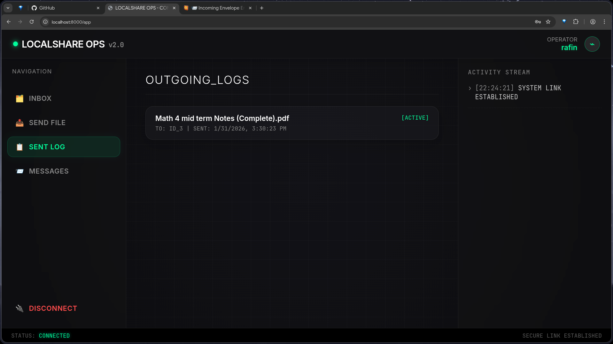
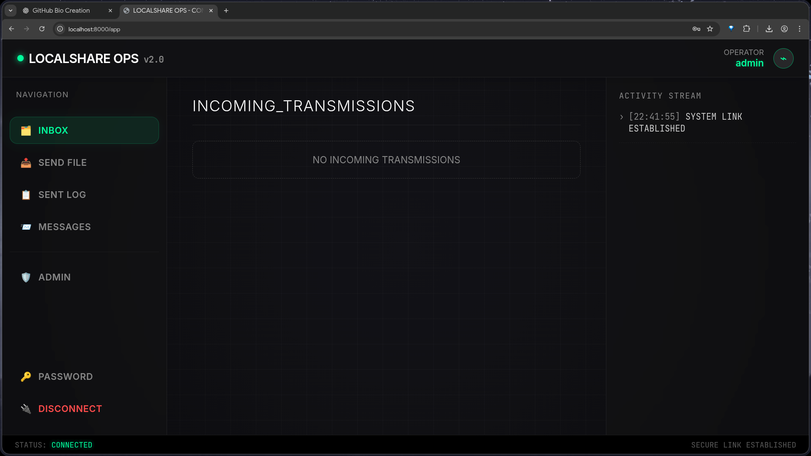
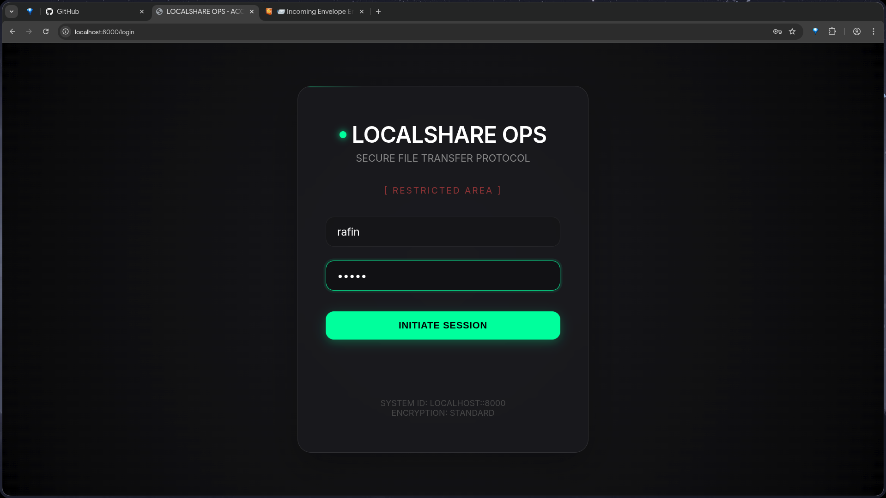
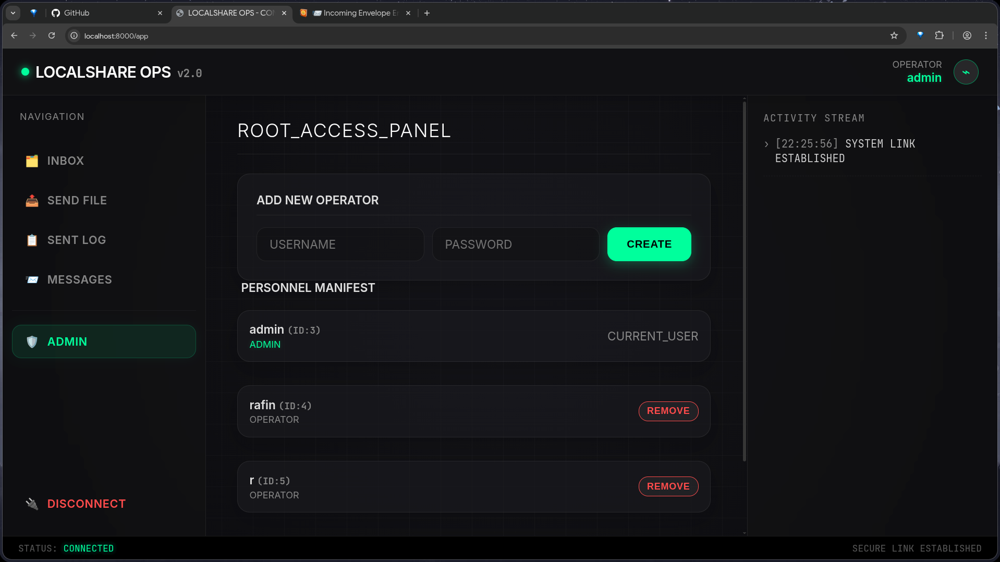
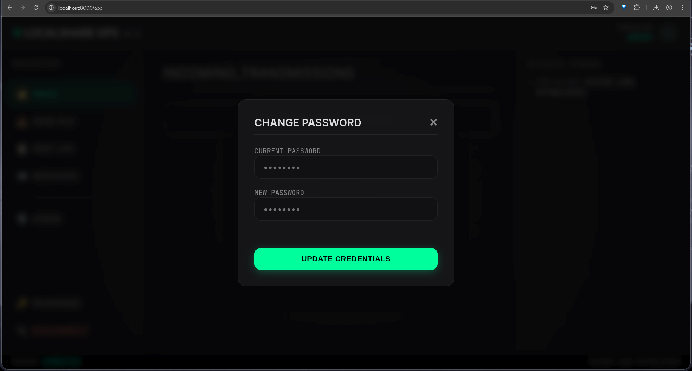

# 🚀 LOCALSHARE OPS | Secure Local Network Transfer System


> **"Data sovereignty in your own subnet."**
> A high-performance, self-hosted operational console for secure file sharing and encrypted messaging within trusted local networks. Server.log file is only for demo to showcase the log's

---

## 📸 Operational Visuals

### Dashboard & Operations
| **Command Console** | **File Upload Interface** |
|:---:|:---:|
|  |  |
| *Real-time File Transfer & Status Monitoring* | *Secure Payload Transmission* |

### Communication & Logs
| **Secure Messaging** | **Transmission Logs** |
|:---:|:---:|
|  |  |
| *Encrypted Local Comm-Link* | *Audit Trail of Transfers* |

### Admin & Security
| **Admin Dashboard** | **Access Control** |
|:---:|:---:|
|  |  |
| *Personnel Management System* | *Secure Entry Gate* |

| **User Management** | **Security Settings** |
|:---:|:---:|
|  |  |
| *Add/Remove Operators* | *Credential Updates* |

---

## 📋 Table of Contents
- [Overview](#overview)
- [Key Features & Use Cases](#key-features--use-cases)
- [System Architecture & Flow](#system-architecture--flow)
- [Project Structure](#project-structure)
- [Installation & Deployment](#installation--deployment)
- [API Documentation](#api-documentation)
- [License](#license)

---

## 🛡️ Overview

**LOCALSHARE OPS** is a purpose-built web application designed to solve the problem of quick, secure, and ephemeral data transfer in environments where internet access is restricted, unreliable, or security-compromised. Unlike cloud solutions (Drive, Dropbox), LocalShare keeps data strictly on the LAN, ensuring zero external leakage.

It features a **High-Tech Cyberpunk/Glassmorphism UI** that provides operators with a distraction-free, high-contrast environment optimized for low-light operations.

---

## ✨ Key Features & Use Cases

### 1. 📂 Ephemeral File Transfer (TTL)
-   **Feature**: Upload files with a set "Time-To-Live" (expiry time).
-   **Use Case**: Transferring sensitive config files or keys between a dev machine and a server that should not persist one the transfer is done.
-   **Tech**: Background cleanup tasks automatically purge expired files from the disk.

### 2. 💬 Secure Local Messaging
-   **Feature**: Persistent, real-time messaging stream between local users.
-   **Use Case**: Coordinating usage of shared local resources (e.g., "I'm rebooting the test server, wait 5 mins") without using external chat apps.
-   **Tech**: Database-backed message history with timestamping.

### 3. 👥 Role-Based Access Control (RBAC)
-   **Feature**: Granular permissions for **Operators** (standard users) and **Admins**.
-   **Use Case**: A team lead (Admin) can onboard new team members (Operators) and manage their access credentials directly from the console.
-   **Tech**: JWT Authentication and scope-based route protection.

### 4. 📊 Admin Dashboard
-   **Feature**: Dedicated panel for managing users and viewing system activity.
-   **Use Case**: Auditing user accounts and removing access for previous employees/guests.

### 5. 📱 Reactive "App-Like" Experience
-   **Feature**: Single Page Application (SPA) feel with a dedicated Mobile UI.
-   **Use Case**: An operator walking around the server room with a tablet/phone can still upload/download files to the workstation.

---

## 🔄 System Architecture & Flow

1.  **Authentication Phase**:
    -   User initiates session at `/login`.
    -   Credentials validated against hashed records in `app.db` (SQLite).
    -   JWT Access Token issued (stored in HTTP-only Secure Cookie).

2.  **Operational Phase**:
    -   **Upload**: User pushes a file -> Server validates size/quota -> File saved with UUID -> DB Record Created with `expires_at`.
    -   **Download**: Recipient logs in -> Checks Inbox -> Server validates expiry/ownership -> File streamed to client.
    -   **Messaging**: Message posted -> stored in `messages` table -> Fetched by recipient's polling/stream loop.

3.  **Maintenance Phase**:
    -   Background `periodic_cleanup` task runs every 60s.
    -   Checks DB for `expires_at < now()`.
    -   Physically removes files from `localshare/uploads` and marks DB record as `EXPIRED`.

---

## 📂 Project Structure

Verified directory structure for deployment consistency:

```bash
file_sharing_server_project/
├── localshare/                 # Core Application Source
│   ├── app/                    # Backend Logic (FastAPI)
│   │   ├── __init__.py
│   │   ├── auth.py             # JWT & Login Logic
│   │   ├── cleanup.py          # Background File Purging
│   │   ├── config.py           # Envs & Constants
│   │   ├── database.py         # SQLAlchemy Setup
│   │   ├── files.py            # File Handling Routes
│   │   ├── main.py             # Entry Point
│   │   ├── messages.py         # Chat Routes
│   │   ├── models.py           # DB Schema
│   │   └── schemas.py          # Pydantic Models
│   │
│   ├── static/                 # Frontend Assets
│   │   ├── app.js              # SPA Logic & API Client
│   │   └── style.css           # Cyberpunk Glassmorphism UI
│   │
│   ├── templates/              # HTML Templates (Jinja2)
│   │   ├── app.html            # Main Dashboard
│   │   └── login.html          # Auth Portal
│   │
│   └── uploads/                # Protected Storage (GitIgnored)
│
├── screenshots/                # Documentation Images
├── venv/                       # Virtual Environment
├── app.db                      # SQLite Database
├── migrate_db.py               # Database Migration Utilities
├── verify_backend.py           # Self-Test Script
├── requirements.txt            # Python Dependencies
├── run.sh                      # Application Launcher
├── setup.sh                    # First-time Installation Script
└── README.md                   # Documentation
```

---

## 🚀 Installation & Deployment

### Prerequisites
-   **OS**: Linux / macOS / WSL
-   **Python**: 3.9+
-   **Ports**: Port `8000` must be free.

### Quick Start
We provide automated scripts for a zero-hassle setup.

**1. Clone & Initialize**
```bash
# Clone the repository (if applicable)
git clone https://github.com/habibul610/localshare-ops
cd localshareops

# Run the Setup Script (Creates venv, installs reqs, inits DB)
chmod +x setup.sh
./setup.sh
```

**2. Launch Server**
```bash
# Start the server (Auto-binds to 0.0.0.0)
chmod +x run.sh
./run.sh
```

**3. Access Console**
-   **Local Machine**: `http://localhost:8000`
-   **Network Devices**: `http://<YOUR_LAN_IP>:8000`

### Default Credentials
| Role | Username | Password |
|:---|:---|:---|
| **Admin** | `admin` | `password123` |
| **Normal** | `user1` | `secret` |

*⚠️ **SECURITY NOTICE**: Change these credentials immediately after first login via the Admin Panel.*

---

## 📖 API Documentation

The system exposes a fully documented REST API compliant with OpenAPI 3.0.

-   **Swagger UI**: `http://localhost:8000/docs` (Interactive testing)
-   **ReDoc**: `http://localhost:8000/redoc`

---

## 🤝 Contribution & Jobs

This project is built using modern, industry-standard practices suitable for enterprise environments.
-   **Backend**: Scalable FastAPI implementation.
-   **Database**: ORM-based abstraction allowing easy swap to PostgreSQL/MySQL.
-   **Frontend**: Dependency-free Vanilla JS for maximum performance and learnability.

**Ideal for:** DevSecOps Tooling, Internal Tooling Developer, Full-Stack Python roles.

---

## Disable firewall If There Is any Issue

## 📄 License

Distributed under the MIT License. See `LICENSE` for more information.
